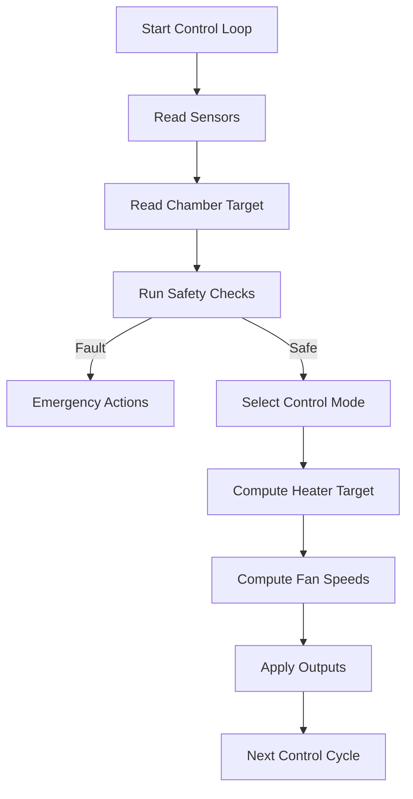
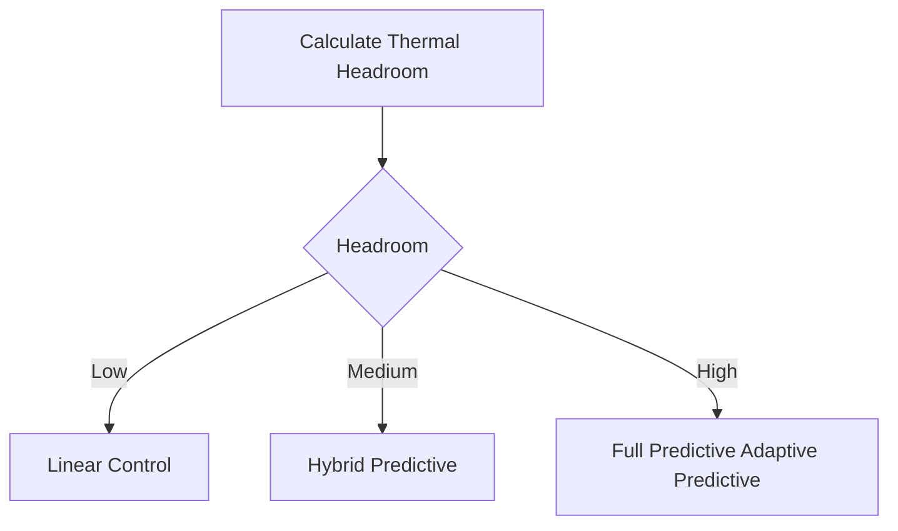
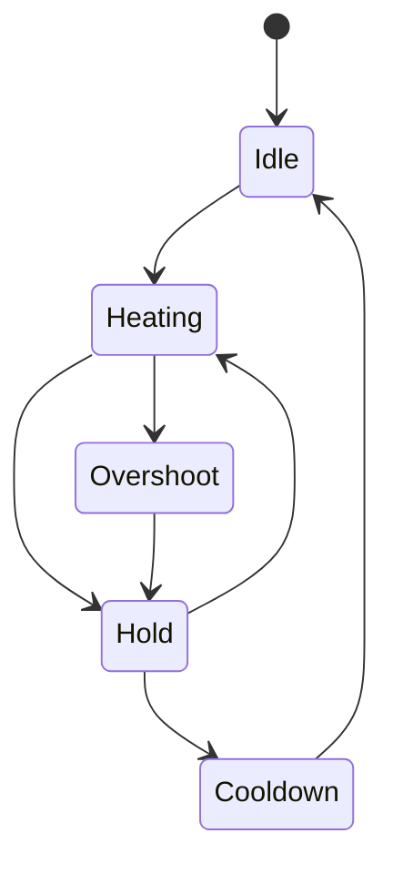
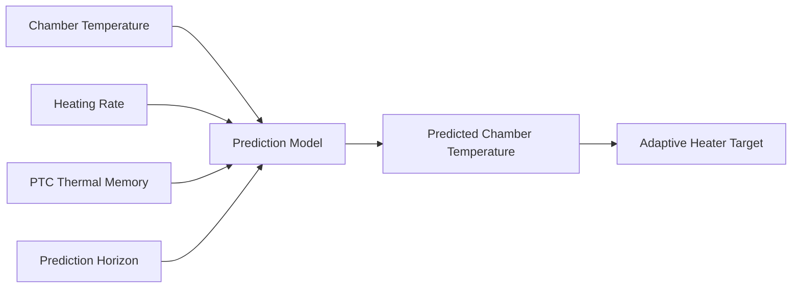
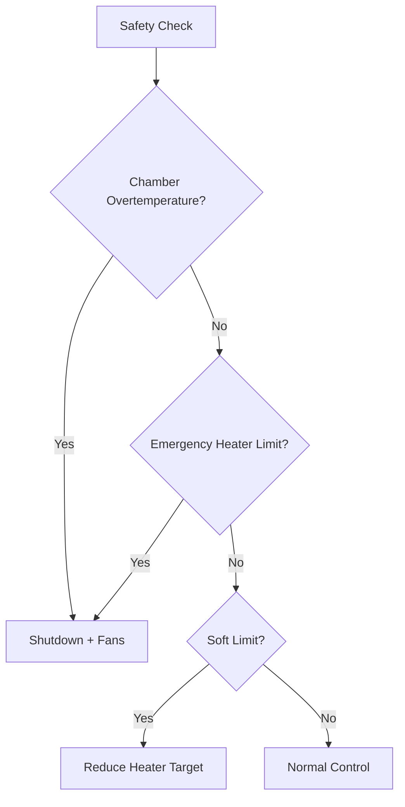
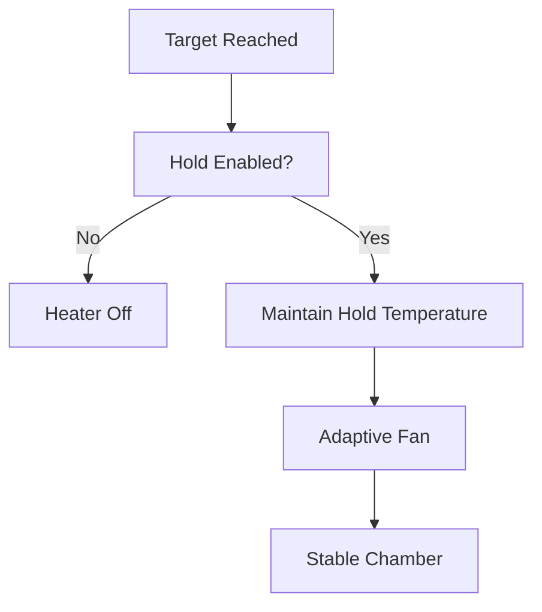
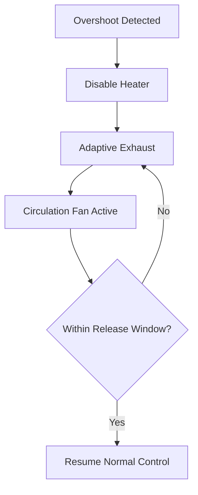
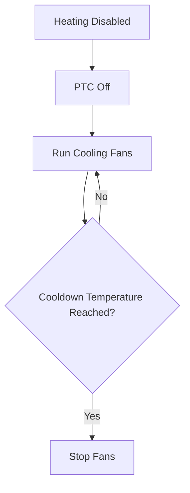

# Flowcharts

This document contains Mermaid diagrams describing the internal workflow
of Smart Chamber Heater.

------------------------------------------------------------------------

# Overall Control Flow

------------------------------------------------------------------------

# Automatic Mode

------------------------------------------------------------------------

# Heating State Machine

------------------------------------------------------------------------

# Prediction Pipeline

------------------------------------------------------------------------

# Safety Priority

------------------------------------------------------------------------

# Hold Mode

------------------------------------------------------------------------

# Overshoot Recovery

------------------------------------------------------------------------

# Cooldown

------------------------------------------------------------------------

# Notes

These diagrams describe the logical behaviour of the controller.

Individual implementations may differ internally, but the overall
architecture and safety priority remain the same.
