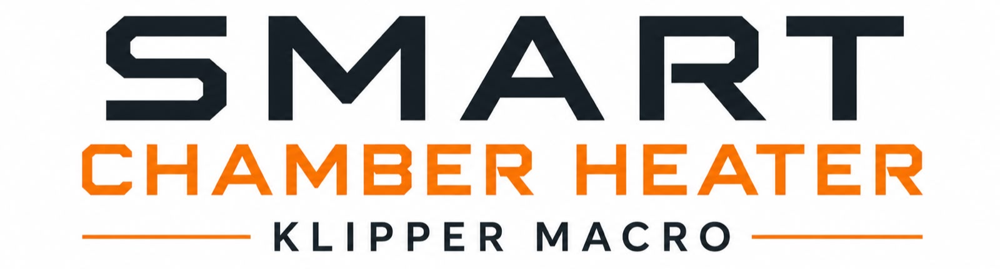

# Smart Chamber Heater

> An adaptive predictive chamber heating controller for Klipper with intelligent heat-up management, safety features and automatic control mode.

Smart Chamber Heater is an advanced chamber heating controller designed
for Klipper.

Instead of acting like a traditional thermostat, the controller
continuously evaluates the thermal state of the printer and dynamically
adapts the heater output to maximize heating performance, improve
temperature stability and reduce overshoot.

> [!WARNING]
> ## Read Before Use
>
> It is **strongly recommended** to read **[usage.md](https://github.com/Nesquirt/Smart_Heated_Chamber_For_Klipper/blob/main/usage.md)**, **[Parameters.md](https://github.com/Nesquirt/Smart_Heated_Chamber_For_Klipper/blob/main/Macro/Parameters.md)** and the **[Wiki](https://github.com/Nesquirt/Smart_Heated_Chamber_For_Klipper/wiki)** before using Smart Chamber Heater.
>
> Smart Chamber Heater behaves differently from a standard Klipper heater. Understanding its operating principles will ensure proper configuration and the best possible performance.

Click the image below and watch the video! 

The project is intended for enclosed printers using a PTC chamber
heater, but its architecture allows it to be adapted to virtually any
chamber heating system.

## 📚 Table of Content

Before using Smart Chamber Heater, it is **strongly recommended** to read the following documentation.

| 📄 Resource | Description |
|------------|-------------|
| 🎥 **[Introduction Video](https://www.youtube.com/watch?v=cAEAzvAO1ms)** | Project overview, features and controller philosophy. |
| 📖 **[Usage Guide](https://github.com/Nesquirt/Smart_Heated_Chamber_For_Klipper/blob/main/usage.md)** | Learn how to use Smart Chamber Heater correctly. |
| ⚙️ **[Configuration Parameters](https://github.com/Nesquirt/Smart_Heated_Chamber_For_Klipper/blob/main/Macro/Parameters.md)** | Configure the controller for your hardware. |
| 🧩 **[Macro Folder](https://github.com/Nesquirt/Smart_Heated_Chamber_For_Klipper/tree/main/Macro)** | Contains `chamber_heater.cfg` and all macro files. |
| 📚 **[Wiki](https://github.com/Nesquirt/Smart_Heated_Chamber_For_Klipper/wiki)** | Installation guides, tuning, examples and technical documentation. |
| ❓ **[FAQ](https://github.com/Nesquirt/Smart_Heated_Chamber_For_Klipper/blob/main/Docs/faq.md)** | Frequently asked questions. |
| 🛡️ **[Security](https://github.com/Nesquirt/Smart_Heated_Chamber_For_Klipper/blob/main/SECURITY.md)** | Safety information and disclaimer. |
| 📂 **[Docs Folder](https://github.com/Nesquirt/Smart_Heated_Chamber_For_Klipper/tree/main/Docs)** | Complete project documentation. |

> [!TIP]
> **New here?** Start with **Usage Guide → Configuration Parameters → Macro Folder → Wiki**.

  -----------------------------------------------------------------------

> WARNING
> 
> ## Safety Disclaimer
> 
> **Smart Chamber Heater is software only.**
> 
> This project controls heating hardware but **cannot guarantee the safety of the complete system**.
> 
> The user is entirely responsible for:
> 
> - Correct electrical wiring.
> - Correct printer configuration.
> - Correct installation.
> - Proper hardware selection.
> - Safe operating conditions.
> - Testing every protection before regular use.
> 
> The authors and contributors **cannot be held responsible** for damages, injuries or losses caused by:
> 
> - Incorrect installation.
> - Incorrect wiring.
> - Configuration errors.
> - Defective heaters.
> - Defective SSRs, relays or power supplies.
> - Defective temperature sensors.
> - Failed thermal fuses.
> - Hardware modifications.
> - User modifications to the source code.
> - Improper use.
> - Fire, overheating or any other hardware failure.
> 
> This software **does not replace** proper electrical design, thermal protection, certified hardware or safe engineering practices.
> 
> **By downloading, installing or using Smart Chamber Heater, you acknowledge that you assume full responsibility for the installation, validation and operation of your printer.**
> 
> Please read **SECURITY.md** before using Smart Chamber Heater.

  -----------------------------------------------------------------------

# Features

- Adaptive chamber heating
- Linear Control
- Hybrid Predictive Control
- Full Adaptive Predictive Control
- Automatic control mode selection
- Chamber prediction model
- PTC thermal memory estimation
- Progressive heater unloading
- Hold Mode
- Adaptive chamber fan control
- Independent heat-assist fan management
- Intelligent exhaust fan control
- Automatic cooldown
- Soft thermal protection
- Thermal fuse protection
- Chamber over-temperature protection
- Diagnostic macros
- Slicer compatibility (M141 / M191)

------------------------------------------------------------------------

> \[!IMPORTANT\]
> 
> Smart Chamber Heater has been designed with safety as the highest
> priority. However, **no software can compensate for faulty hardware,
> unsafe wiring or improper installation**.
> 
> **This software does not replace proper electrical design, thermal
> protection, hardware safety devices or common sense.**
> 
> **All mains-powered heating systems can be hazardous if improperly
> designed, assembled or operated.**
> 
> Every protection implemented by this project assumes that the printer
> has been correctly assembled, electrically verified and equipped with
> appropriate hardware safety devices.

------------------------------------------------------------------------

# Why Smart Chamber Heater?

Most chamber heating implementations simply turn a heater ON until a
target temperature is reached.

Smart Chamber Heater continuously evaluates:

- Chamber temperature
- Chamber heating rate
- Remaining thermal energy stored inside the PTC
- Future chamber temperature
- Available thermal headroom

and dynamically adapts the heater output to maximize stability and
performance.

------------------------------------------------------------------------

# Control Algorithms

## Automatic Control

Automatically selects the most suitable algorithm according to the
available thermal headroom.

## Linear Control

Uses only the current chamber temperature.

Recommended for: - Low-power PTC heaters - Large chambers - Limited
thermal headroom

## Hybrid Predictive Control

Combines maximum heat-up performance with predictive unloading near the
target.

## Full Adaptive Predictive Control

Uses:

- Chamber temperature
- Chamber heating rate
- Remaining PTC thermal energy
- Future chamber prediction
- Nonlinear control curves

to continuously adapt heater output.

------------------------------------------------------------------------

# Prediction Model

Predicted Chamber Temperature =

Current Chamber Temperature

- Heating Rate × Prediction Horizon

- Remaining PTC Thermal Energy

------------------------------------------------------------------------

# Hold Mode

Maintains the PTC at a configurable temperature after the chamber target
is reached to improve stability and reduce heater cycling.

------------------------------------------------------------------------

# Safety

Independent safety layers include:

- Thermal Fuse Protection
- PTC Soft Limit
- Emergency Shutdown
- Chamber Overtemperature Protection
- Overshoot Cooling
- Automatic Cooldown

------------------------------------------------------------------------

# Diagnostic Macros

  ---------------------------------------------------------------------

  Macro                      Description

  -------------------------- ------------------------------------------

CHAMBER_LIMITS               Display calculated thermal limits

CHAMBER_CONTROL_STATUS       Show selected algorithm and next control decision

CHAMBER_PREDICTION_STATUS    Show prediction model values

------------------------------------------------------------------------

# Compatibility

Designed for Klipper.

Compatible with:

- heater_generic
- temperature_sensor
- fan_generic
- delayed_gcode
- gcode_macro

------------------------------------------------------------------------

# Roadmap

- Adaptive self-learning
- Ambient temperature compensation
- Chamber thermal mass estimation
- Automatic heater characterization
- Multi-zone chamber heating

------------------------------------------------------------------------

# License

MIT License.

